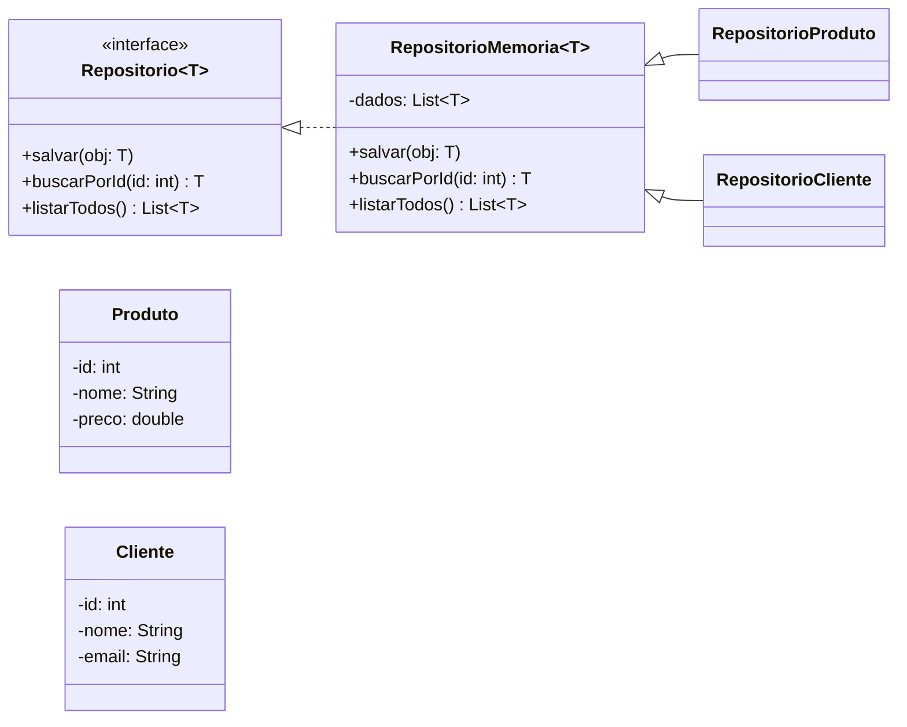

# 📘 Lista de Exercícios – Java Generics - Entrega do Desafio 27/08

### **Exercício 1 – Lista Genérica**
Implemente uma classe genérica `Caixa<T>` que pode armazenar um objeto de qualquer tipo.
- Crie métodos para adicionar (`set`) e recuperar (`get`) o objeto armazenado.
- Teste a classe com diferentes tipos (`String`, `Integer`, `Double`).

---

### **Exercício 2 – Método Genérico**
Crie um método genérico `printArray` que recebe um array de qualquer tipo e imprime seus elementos.
- Teste com arrays de `Integer`, `Double` e `String`.

---

### **Exercício 3 – Comparação Genérica**
Implemente uma interface genérica `Comparavel<T>` com um método `ehMaiorQue(T outro)`.
- Crie uma classe `Produto` que implemente essa interface comparando pelo preço.
- Teste a comparação entre dois produtos.

---

### **Exercício 4 – Bounded Generics**
Implemente um método genérico `max` que recebe uma lista de elementos que implementam `Comparable<T>` e retorna o maior elemento.
- Teste com `Integer`, `Double` e `String`.

---

### **Exercício 5 – Generic com Múltiplos Parâmetros**
Implemente uma classe genérica `Par<K, V>` que representa um par chave-valor.
- Crie uma lista de pares representando alunos (`matrícula`, `nome`).
- Imprima todos os pares.

---

### **Exercício 6 – Wildcards (`?`)**
Crie um método `imprimirNumeros(List<? extends Number>)` que recebe uma lista de qualquer tipo que seja `Number` ou seus filhos (`Integer`, `Double`, `Float`) e imprime os valores.
- Teste com listas de diferentes tipos numéricos.

---

### **Exercício 7 – Stack Genérica**
Implemente uma classe `Pilha<T>` que simula o comportamento de uma pilha (push, pop, peek, isEmpty).
- Teste com pilha de `Integer` e pilha de `String`.

---

### **Exercício 8 – Desafio Final (Avançado com UML)**
Crie um sistema de **repositório genérico** com as seguintes regras:

1. Implemente uma interface `Repositorio<T>` com os métodos:
    - `void salvar(T obj);`
    - `T buscarPorId(int id);`
    - `List<T> listarTodos();`

2. Crie uma classe abstrata `RepositorioMemoria<T>` que implementa `Repositorio<T>` usando uma lista interna (`ArrayList`).

3. Crie duas classes concretas:
    - `RepositorioProduto` (para objetos do tipo `Produto`).
    - `RepositorioCliente` (para objetos do tipo `Cliente`).

4. Teste salvando e recuperando objetos de diferentes tipos.

---

## 📊 Diagrama UML do Desafio

